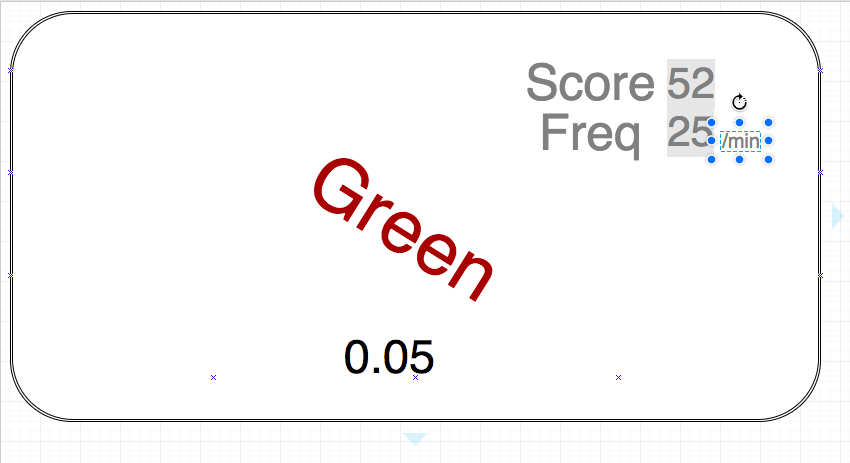

# Dissonance 
## An homage to V
### By Andrea McKenzie, 
### Oct 6. 2017

V is a game where you have a word that represents a color. The word may be the same color as what it reads, e.g. "red" being the color red. Or, it could not, e.g. "red" could be the color blue. You have to left click if the word and color match, or right click if they don't, all within less than a second. But is it just that easy? The longer you go, the harder it gets. The background is usually white, but what if it changes to the correct word's color? What if it changes to the **wrong** color? What if the word is upside down? What if the controls invert? How long can you handle the dissonance?

[The Game](https://gamejolt.com/games/v/122286)
["Let's Play"'er Markiplier playing the game](https://www.youtube.com/watch?v=JuSsJFpEnV4)

## WireFrame

## Challanges & Goals

I would say the biggest challange will be styling it in a way that's similar to V. Certain things, like the VHS style distortion can't yet really be done with traditional CSS. Also, having the collectiion of affections on the screen based upon how many turns have passed will be time-consuming and a bit difficult to implement. 

##Phases of completion
  *Placing all items on the page, such as timer, word, and score
  *Writing the logic for randomly cycling the words and colors
  *Styling the distortions 
